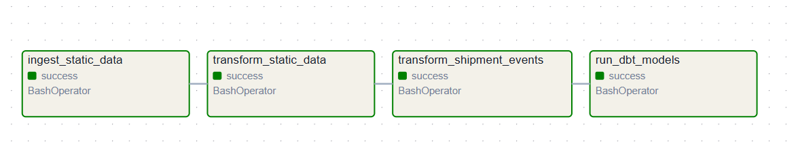

# 🚚 FlowTrack: Supply Chain Monitoring Pipeline

FlowTrack is an end-to-end data engineering project that simulates a modern supply chain monitoring platform. It combines **batch ingestion**, **streaming event processing**, **data modeling**, **workflow orchestration**, and **business-ready analytics tables** to provide real-time visibility into shipment operations.

The platform ingests static reference data such as warehouses, routes, carriers, and shipments, then combines it with real-time shipment event streams to generate actionable insights around shipment status, delays, route performance, and carrier efficiency.

---

## 📌 Project Overview

This project was built to simulate a realistic logistics data platform used by:

* logistics and transportation companies
* e-commerce fulfillment teams
* delivery operations teams
* analytics teams monitoring shipment performance

FlowTrack demonstrates how a modern data stack can be used to:

* ingest static and streaming data
* clean and standardize operational datasets
* track shipment lifecycle events in near real time
* model analytics-ready marts for BI tools
* orchestrate repeatable workflows with Airflow
* validate data quality with dbt tests

---

## 🎯 Business Goals

The main business objectives of FlowTrack are to:

* monitor current shipment status in real time
* identify delayed shipments and delay reasons
* analyze carrier performance
* analyze route performance
* provide clean, dashboard-ready analytics tables
* create a scalable, reproducible local data platform

---

## 🧱 Final Architecture

### Data Flow

#### 1) Batch Pipeline

CSV files → PostgreSQL raw tables → transformation jobs → PostgreSQL staging tables

#### 2) Streaming Pipeline

Python shipment event generator → Kafka topic → Python consumer → PostgreSQL raw event table → transformation job → PostgreSQL staging event table

#### 3) Analytics Layer

Staging tables → dbt models → analytics marts

#### 4) Orchestration Layer

Airflow DAG → batch ingestion + transformations + dbt refresh

#### 5) BI Layer

PostgreSQL analytics schema → Power BI

---

## 🛠️ Tech Stack

### Core Infrastructure

* **Docker Compose** — local orchestration of all services
* **PostgreSQL** — storage layer for raw, staging, and analytics data
* **pgAdmin** — database exploration and validation

### Data Processing

* **Python** — ingestion scripts, producer, and consumer logic
* **Spark container** — transformation runtime for batch jobs
* **Kafka** — real-time event streaming
* **Zookeeper** — Kafka coordination

### Transformation & Modeling

* **dbt** — staging views, marts, and data quality tests

### Orchestration

* **Apache Airflow** — DAG-based workflow scheduling and execution

### Visualization

* **Power BI** — BI connection and dashboarding layer


---

## 🗃️ Data Model

### Raw Layer

The raw layer stores source data with minimal modification.

#### Static raw tables

* `raw.warehouses`
* `raw.carriers`
* `raw.routes`
* `raw.shipments`

#### Streaming raw table

* `raw.shipment_events`

### Staging Layer

The staging layer standardizes and cleans incoming records.

#### Static staging tables

* `staging.stg_warehouses`
* `staging.stg_carriers`
* `staging.stg_routes`
* `staging.stg_shipments`

#### Event staging table

* `staging.stg_shipment_events`

### Analytics Layer

The analytics layer contains BI-ready marts used by Power BI.

#### Final marts

* `analytics.mart_shipment_overview`
* `analytics.mart_live_shipment_status`
* `analytics.mart_carrier_performance`
* `analytics.mart_route_performance`
* `analytics.mart_shipment_status`
* `analytics.mart_delayed_shipments`
* `analytics.mart_delay_events`

---

## 📘 Dataset Description

### Static Reference Data

The project starts with controlled CSV datasets to establish a consistent operational model:

* `warehouses.csv`
* `carriers.csv`
* `routes.csv`
* `shipments.csv`

These files are ingested into PostgreSQL and transformed into structured staging tables.

### Streaming Event Data

Shipment lifecycle events are generated in real time through a Python event generator.

Example lifecycle:

```text
shipment_created → picked_up → in_transit → arrived_at_hub → out_for_delivery → delivered
```

Optional delay events may appear between valid lifecycle stages:

* `delayed`

This design makes the event stream more realistic and suitable for real operational analysis.

---

## 🔄 End-to-End Pipeline Walkthrough

### 1) Static Ingestion

The static CSV files are loaded into PostgreSQL raw tables using the batch ingestion script.

**Script:**

* `spark/batch/ingest_static_data.py`

### 2) Static Transformations

Raw static tables are cleaned and written into staging tables.

**Transformations include:**

* trimming text fields
* standardizing values
* deduplicating records
* converting timestamps and numeric types
* creating simple business flags such as `is_priority`

**Script:**

* `spark/batch/transform_static_data.py`

### 3) Streaming Ingestion

A Python producer continuously generates shipment events and publishes them to Kafka.
A consumer reads those events and writes them into PostgreSQL.

**Scripts:**

* `producer/generator.py`
* `producer/producer.py`
* `producer/consumer_to_postgres.py`

### 4) Event Transformations

Raw shipment events are cleaned and standardized in the staging layer.

**Script:**

* `spark/batch/transform_shipment_events.py`

### 5) Analytics Modeling

dbt builds staging views and business marts in the analytics schema.

**Key outputs include:**

* live shipment status
* carrier performance
* route performance
* shipment status breakdown
* historical delay events

### 6) Workflow Orchestration

Airflow orchestrates the batch ingestion, transformation, event processing refresh, and dbt model execution.

**DAG:**

* `flowtrack_batch_pipeline`

---

## 📡 Streaming Design

The streaming layer simulates a real operational monitoring workflow.

### Producer responsibilities

* generate shipment lifecycle events
* assign dynamic shipment IDs
* simulate realistic progress through valid statuses
* inject delay events with realistic causes

### Kafka topic

* `shipment_events`

### Consumer responsibilities

* read shipment events from Kafka
* insert events into `raw.shipment_events`
* preserve event history for downstream analytics

### Example delay reasons

* traffic
* weather
* warehouse backlog
* vehicle issue

---

## 📊 Analytics Marts Explained

### `mart_shipment_overview`

A denormalized shipment-level table combining shipment, route, carrier, and warehouse metadata.

**Use cases:**

* shipment-level drill down
* detail views in BI
* shipment monitoring tables

### `mart_live_shipment_status`

Returns the latest known event for each shipment.

**Use cases:**

* live tracking dashboard
* current operational visibility
* shipment status cards

### `mart_carrier_performance`

Aggregated performance view by carrier.

**Use cases:**

* compare carrier efficiency
* identify underperforming carriers
* calculate delivery success rates

### `mart_route_performance`

Aggregated performance view by route.

**Use cases:**

* identify routes with delays
* compare route efficiency
* analyze shipment volume by route

### `mart_shipment_status`

Simple shipment status distribution table.

**Use cases:**

* KPI cards
* donut or bar charts for current shipment distribution

### `mart_delayed_shipments`

Contains shipments whose **current** latest status is delayed.

**Use cases:**

* active exception monitoring
* operations alerting

### `mart_delay_events`

Contains all historical delay events.

**Use cases:**

* delay reason analysis
* historical exception analysis
* delay frequency by route/carrier/location

---

## ✅ Data Quality Checks

dbt tests are used to validate data quality.

### Examples of implemented tests

* `not_null` on primary business keys
* `unique` on shipment and route identifiers
* `accepted_values` on shipment status values

### Why this matters

These tests ensure the analytics layer is trustworthy before being consumed by Power BI.

---

## ⏱️ Airflow Orchestration

The Airflow DAG automates the main pipeline steps in sequence:

1. `ingest_static_data`
2. `transform_static_data`
3. `transform_shipment_events`
4. `run_dbt_models`

This creates a repeatable orchestration layer instead of manually running each script.

### Airflow DAG Success Screenshot



---

## 🖼️ Power BI Connection

Power BI connects directly to PostgreSQL using the analytics schema.

### Connection settings

* **Server:** `localhost:5435`
* **Database:** `flowtrack`
* **Username:** `flowtrack`
* **Password:** `flowtrack`
* **Mode:** Import

### Recommended tables for Power BI

* `analytics.mart_live_shipment_status`
* `analytics.mart_carrier_performance`
* `analytics.mart_route_performance`
* `analytics.mart_shipment_status`
* `analytics.mart_delay_events`
* `analytics.mart_shipment_overview`

Optional:

* `analytics.mart_delayed_shipments`

---

## 📈 Suggested Dashboard Pages

### 1) Executive Overview

Recommended visuals:

* total shipments
* current delayed shipments
* shipment status distribution
* live shipment table

Recommended tables:

* `mart_live_shipment_status`
* `mart_shipment_status`

### 2) Carrier Performance

Recommended visuals:

* delivery success rate by carrier
* delayed shipments by carrier
* total shipments by carrier

Recommended table:

* `mart_carrier_performance`

### 3) Route Performance

Recommended visuals:

* delay rate by route
* total shipments by route
* route distance vs delay rate

Recommended table:

* `mart_route_performance`

### 4) Delays & Exceptions

Recommended visuals:

* delay events by reason
* delay events by carrier
* delay events by location
* currently delayed shipments

Recommended tables:

* `mart_delay_events`
* `mart_delayed_shipments`

---

## 🚀 How to Run the Project

### 1) Start the services

```bash
docker compose up -d
```

### 2) Verify running containers

```bash
docker compose ps
```

### 3) Run the batch pipeline manually if needed

```bash
docker exec -it flowtrack_spark python3 /opt/spark/work-dir/jobs/batch/ingest_static_data.py
docker exec -it flowtrack_spark python3 /opt/spark/work-dir/jobs/batch/transform_static_data.py
docker exec -it flowtrack_spark python3 /opt/spark/work-dir/jobs/batch/transform_shipment_events.py
docker exec -it flowtrack_dbt dbt run --profiles-dir /usr/app
```

### 4) Run dbt tests

```bash
docker exec -it flowtrack_dbt dbt test --profiles-dir /usr/app
```

### 5) Start the streaming pipeline

Open one terminal for the producer:

```bash
docker exec -it flowtrack_producer python producer.py
```

Open a second terminal for the consumer:

```bash
docker exec -it flowtrack_producer python consumer_to_postgres.py
```

### 6) Trigger the Airflow DAG

Use the Airflow UI to trigger:

* `flowtrack_batch_pipeline`

---

## 🧪 Example Validation Queries

### Count transformed event records

```sql
SELECT COUNT(*) FROM staging.stg_shipment_events;
```

### Check current live status

```sql
SELECT * FROM analytics.mart_live_shipment_status;
```

### Check historical delay events

```sql
SELECT * FROM analytics.mart_delay_events;
```

### Check carrier performance

```sql
SELECT * FROM analytics.mart_carrier_performance;
```

---


Built as an end-to-end data engineering portfolio project focused on supply chain monitoring, streaming analytics, orchestration, and BI-ready data m
